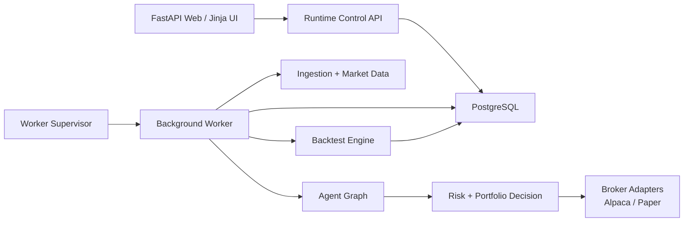

# FionaTrade

[](https://www.python.org/)
[](https://fastapi.tiangolo.com/)
[](https://www.postgresql.org/)
[](https://alpaca.markets/)
[](https://www.langchain.com/langgraph)

FionaTrade is a PostgreSQL-first autonomous trading research platform that
combines:

- a FastAPI control plane and web UI
- a worker/supervisor runtime for live and scheduled tasks
- a multi-agent decision graph for research and execution
- paper/live broker adapters and backtest tooling
- operator harness scripts for replay, preflight, and regression checks

The public repository focuses on the **core FionaTrade platform**. Strategy-
specific news engines, proprietary datasets, and Benzinga-specific private work
have been intentionally kept out of this repository.

## Why FionaTrade

- **Production-minded runtime split**
  - Web, worker, and database responsibilities are separated instead of being
    collapsed into a single notebook-style process.
- **PostgreSQL-backed control plane**
  - Live runtime state, command queue, worker heartbeats, and execution records
    are persisted in the database.
- **Unified research and execution stack**
  - Backtest, paper, and live paths share the same core models and broker
    abstractions.
- **Agent-driven decision pipeline**
  - Macro, news, fundamentals, technicals, risk, and portfolio stages are
    modeled explicitly instead of as ad hoc LLM calls.
- **Operator harness included**
  - Preflight checks, replay tooling, and golden-eval scripts are part of the
    repository rather than private glue code.

## Architecture



Core boundaries:

- `app/main.py`: web entrypoint only
- `app/worker/`: supervisor + worker runtime
- `app/agent_graph/`: multi-agent orchestration
- `app/services/live_trading.py`: live execution orchestration
- `app/backtest_engine/`: offline replay and research
- `app/broker/`: execution adapters

## Features

- Live and paper trading workflows
- Multi-agent decision graph with explicit state transitions
- Database-backed command queue and worker heartbeat model
- Backtest UI and worker-backed backtest execution
- Runtime guardrails for live trading
- Operator-focused replay and preflight harness
- FastAPI + Jinja monitoring and control dashboard

## Quick Start

### 1. Install

```bash
pip install -e .[dev]
```

### 2. Configure

```bash
cp .env.example .env
```

Fill in the required values in `.env`, including your database URL, LLM
configuration, and market-data / broker credentials.

Important runtime assumptions:

- Production runtime is **PostgreSQL**
- SQLite is for tests and ad hoc local fixtures only
- All persisted timestamps are treated as UTC

### 3. Run locally

```bash
./run_local.sh
```

Or run the processes separately:

```bash
uvicorn app.main:app --host 0.0.0.0 --port 6888 --reload
python -m app.worker.supervisor
```

Then open:

```text
http://localhost:6888
```

## Test

Run the full test suite:

```bash
pytest
```

Key validation areas:

- `tests/test_live_event_driven.py`
- `tests/test_live_guardrails.py`
- `tests/test_live_service_core.py`
- `tests/test_worker_control_plane.py`
- `tests/test_brokers.py`
- `tests/test_paper_engine.py`
- `tests/test_backtest_agent_mode.py`

## Repository Layout

```text
app/
  agent_graph/        agent orchestration
  api/                REST endpoints
  backtest_engine/    replay and backtest services
  broker/             Alpaca and paper adapters
  core/               settings, logging, market hours
  db/                 SQLAlchemy models and session helpers
  ingestion/          source clients and ingestion services
  monitoring/         health and source audits
  services/           live trading, runtime control, worker runtime
  tools/              agent-facing read tools
  webui/              Jinja routes
  worker/             worker entrypoint and supervisor

scripts/              operational and harness tooling
templates/            Jinja templates
tests/                pytest suite
```

## Documentation

- Original operator-oriented README preserved at
  [docs/README.operator.zh-CN.md](docs/README.operator.zh-CN.md)
- Agent/repository contract:
  [AGENTS.md](AGENTS.md)
- Archived internal research/reference notes:
  - [docs/archive](docs/archive)
  - [docs/reference](docs/reference)

## Scope Notes

This public repository intentionally excludes:

- proprietary strategy datasets
- private operational memory and handoff logs
- Benzinga-specific private strategy modules extracted into a separate repo

## Disclaimer

This project is for research and engineering purposes. It is not investment
advice, not a promise of profitability, and not a substitute for independent
risk review.
