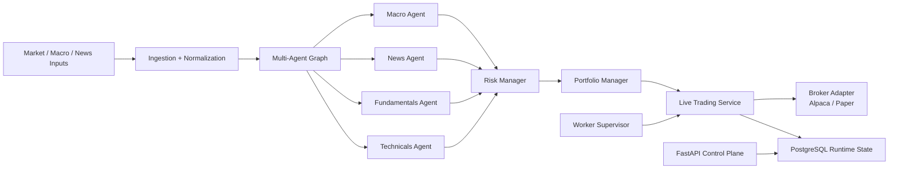

# FionaTrade 🚀

[](https://www.python.org/)
[](https://fastapi.tiangolo.com/)
[](https://www.postgresql.org/)
[](https://alpaca.markets/)
[](https://www.langchain.com/langgraph)
[](./tests)

> 🤖 **Autonomous trading infrastructure. Real runtime boundaries. Direct broker execution.**  
> FionaTrade is an end-to-end multi-agent trading platform designed to **ingest,
> reason, decide, risk-check, and trade** without collapsing everything into a
> single notebook or a single model call.

📘 Chinese public overview:
[docs/README.public.zh-CN.md](docs/README.public.zh-CN.md)

## ✨ What FionaTrade Is

FionaTrade is a **PostgreSQL-first autonomous trading research and execution
stack** built around one strong idea:

> a serious trading system should be able to **think, decide, act, and be
> operated** as a system.

It combines:

- 🧠 **Autonomous multi-agent reasoning**
  - macro, news, fundamentals, technicals, risk, and portfolio each have an
    explicit role
- 🏦 **Direct broker integration**
  - paper and live execution are implemented through broker adapters
- 🧭 **Persistent runtime control**
  - command queue, worker heartbeats, runtime state, and execution records live
    in PostgreSQL
- 🔁 **Research-to-execution continuity**
  - backtest, paper, and live share the same core architecture
- 🛠️ **Operator harness**
  - preflight, replay, and regression tooling are part of the repository

The public repository focuses on the **core FionaTrade platform**. Proprietary
datasets, private operational notes, and Benzinga-specific private strategy
work are intentionally excluded.

## 🔥 Why It Stands Out

| Capability | FionaTrade approach |
|---|---|
| Strategy engine | Explicit multi-agent pipeline instead of one opaque prompt |
| Execution | Direct broker adapters for paper and live trading |
| Control plane | FastAPI + Jinja UI backed by database runtime state |
| Runtime model | Separate web, worker, database, and broker responsibilities |
| Safety | Risk gates, live guardrails, replay tooling, command queue |
| Research loop | Backtests and operator harness are first-class citizens |

In short:

- not just a backtester 📉
- not just an LLM wrapper 🧩
- not just a dashboard 📟
- but a **full autonomous trading operating stack** ⚡

## 🧠 Multi-Agent, For Real

FionaTrade does **not** treat AI as one giant black box.  
It decomposes the decision process into specialized agents with explicit
responsibilities:

| Agent | Role |
|---|---|
| `MacroAnalystAgent` | Understands macro regime, FRED data, and risk backdrop |
| `NewsSentimentAgent` | Reads event/news context and extracts directional narrative |
| `FundamentalsAgent` | Adds structural company and analyst context |
| `TechnicalsAgent` | Supplies rule-based technical state and price structure |
| `RiskManagerAgent` | Applies position-level and portfolio-level risk judgment |
| `PortfolioManagerAgent` | Produces the final actionable trade decision |

This is one of the strongest parts of the platform:

- easier to inspect 🔍
- easier to replay 🔁
- easier to constrain 🧱
- easier to test 🧪
- easier to improve over time 📈

Instead of saying "the model decided," FionaTrade can say **which stage decided
what, and why**.

## 🏦 Direct Broker Execution

FionaTrade is not a research toy pretending execution is someone else's
problem.

Execution is already part of the core stack:

- `app/broker/alpaca.py`
  - live/paper broker integration
- `app/broker/paper.py`
  - deterministic paper execution model
- `app/services/live_trading.py`
  - the orchestration layer that turns decisions into orders

That means the platform can move through:

1. research
2. backtest
3. paper trading
4. live execution

without swapping out the entire architecture halfway through.

## ⚙️ End-to-End Autonomous Loop



This is the core FionaTrade promise:

- 💡 **it can think**
  - via specialized agents
- 🧾 **it can decide**
  - via explicit risk and portfolio stages
- 🏃 **it can act**
  - via direct broker execution adapters
- 🕹️ **it can be operated**
  - via a database-backed control plane and web UI

## 🏗️ Production-Minded Runtime Split

```text
web    -> FastAPI + Jinja UI + API control plane
worker -> scheduler + ingestion + live cycle + command pump
db     -> PostgreSQL runtime state, caches, control records, results
broker -> Alpaca / Paper execution adapters
```

Core boundaries:

- `app/main.py`
  - web entrypoint only
- `app/worker/`
  - worker runtime and supervisor
- `app/agent_graph/`
  - multi-agent orchestration
- `app/services/live_trading.py`
  - live execution engine
- `app/backtest_engine/`
  - offline replay and backtest layer
- `app/broker/`
  - broker adapters

This separation is a major engineering advantage:

- UI does not pretend to be the runtime
- worker logic does not pretend to be the control plane
- runtime state does not disappear with the process
- execution is not faked at the edge of the system

## 🌟 Feature Highlights

- 🤖 Multi-agent decision graph with explicit stages
- 🏦 Direct Alpaca integration for paper and live execution
- 🗄️ PostgreSQL-backed runtime state and command queue
- 🧵 Worker supervisor + heartbeat model
- 📊 Backtest execution through the same application stack
- 🧪 Replay and preflight harness for operator workflows
- 🛡️ Live guardrails and runtime safety checks
- 🖥️ FastAPI + Jinja monitoring and control dashboard

## 🚀 Quick Start

### 1. Install

```bash
pip install -e .[dev]
```

### 2. Configure

```bash
cp .env.example .env
```

Fill in:

- database URL
- LLM configuration
- market-data credentials
- broker credentials

Runtime assumptions:

- PostgreSQL is the **primary runtime database**
- SQLite is for tests and ad hoc local fixtures only
- persisted timestamps are treated as UTC

### 3. Run locally

```bash
./run_local.sh
```

Or run the services separately:

```bash
uvicorn app.main:app --host 0.0.0.0 --port 6888 --reload
python -m app.worker.supervisor
```

Then open:

```text
http://localhost:6888
```

## 🧪 Test

Run the full suite:

```bash
pytest
```

Important validation areas:

- `tests/test_live_event_driven.py`
- `tests/test_live_guardrails.py`
- `tests/test_live_service_core.py`
- `tests/test_worker_control_plane.py`
- `tests/test_brokers.py`
- `tests/test_paper_engine.py`
- `tests/test_backtest_agent_mode.py`

## 📁 Repository Layout

```text
app/
  agent_graph/        agent orchestration
  api/                REST endpoints
  backtest_engine/    replay and backtest services
  broker/             Alpaca and paper adapters
  core/               settings, logging, market hours
  db/                 SQLAlchemy models and session helpers
  ingestion/          source clients and ingestion services
  monitoring/         health and source audits
  services/           live trading, runtime control, worker runtime
  tools/              agent-facing read tools
  webui/              Jinja routes
  worker/             worker entrypoint and supervisor

scripts/              operational and harness tooling
templates/            Jinja templates
tests/                pytest suite
```

## 📚 Documentation

- Public Chinese overview:
  [docs/README.public.zh-CN.md](docs/README.public.zh-CN.md)
- Original operator-oriented README:
  [docs/README.operator.zh-CN.md](docs/README.operator.zh-CN.md)
- Agent/repository contract:
  [AGENTS.md](AGENTS.md)
- Internal reference notes:
  [docs/reference](docs/reference)

## 🎯 Scope Notes

This public repository intentionally excludes:

- proprietary strategy datasets
- private operational memory and handoff logs
- Benzinga-specific private strategy modules extracted into a separate repo

## ⚠️ Disclaimer

This project is for research and engineering purposes. It is **not investment
advice**, **not a promise of profitability**, and **not a substitute for
independent risk review**.
