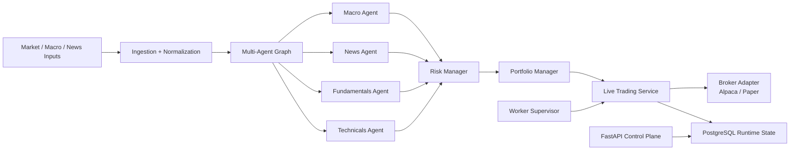

# FionaTrade

[](https://www.python.org/)
[](https://fastapi.tiangolo.com/)
[](https://www.postgresql.org/)
[](https://alpaca.markets/)
[](https://www.langchain.com/langgraph)
[](./tests)

> **Autonomous trading infrastructure, not a notebook demo.**  
> FionaTrade is an end-to-end multi-agent trading platform that can ingest
> market context, reason across specialized agents, route decisions through
> risk controls, and send orders directly to a broker.

## What FionaTrade Is

FionaTrade is a PostgreSQL-first trading research and execution stack built for
people who want a system with explicit runtime boundaries:

- **Autonomous decision loop**
  - Ingest data, build context, run a multi-agent decision graph, apply risk
    gating, and execute through a broker adapter.
- **Direct broker integration**
  - Paper and live execution paths are implemented through broker adapters
    instead of being left as hypothetical backtest-only logic.
- **Persistent runtime control**
  - Worker heartbeat, command queue, live runtime state, and execution records
    are stored in PostgreSQL rather than process-local memory.
- **Research-to-execution continuity**
  - Backtest, paper, and live all share the same core application model.
- **Operator harness included**
  - Replay, preflight, and regression tooling ship with the repo.

The public repository focuses on the **core FionaTrade platform**. Proprietary
datasets, private operational notes, and Benzinga-specific private strategy
work are intentionally excluded.

## Why It Stands Out

| Capability | FionaTrade approach |
|---|---|
| Strategy engine | Explicit multi-agent pipeline instead of a single opaque model call |
| Execution | Direct broker adapters for paper and live trading |
| Control plane | FastAPI + Jinja UI backed by database runtime state |
| Runtime model | Separate web, worker, and database responsibilities |
| Safety | Risk gates, live guardrails, command queue, replay tooling |
| Research loop | Backtests and operator harness are first-class parts of the repo |

## End-to-End Autonomous Loop



This is the core claim of the system:

- **it can think**
  - via specialized agents with different responsibilities
- **it can decide**
  - via risk and portfolio aggregation
- **it can act**
  - via direct broker execution adapters
- **it can be operated**
  - via database-backed runtime control and a web UI

## Multi-Agent Roles

FionaTrade does not treat "AI" as one giant prompt. The current architecture
splits responsibility across dedicated components:

| Agent | Role |
|---|---|
| `MacroAnalystAgent` | Interprets macro regime, FRED signals, and higher-level risk backdrop |
| `NewsSentimentAgent` | Reads event/news context and extracts directional narrative |
| `FundamentalsAgent` | Uses company fundamentals and analyst context as structural input |
| `TechnicalsAgent` | Provides rule-based technical state and price structure context |
| `RiskManagerAgent` | Applies position-level and portfolio-level risk judgment |
| `PortfolioManagerAgent` | Produces the final actionable trade decision |

This matters because the architecture is easier to:

- inspect
- replay
- test
- constrain
- evolve

than a monolithic "LLM decides everything" design.

## Direct Broker Execution

FionaTrade is not just a charting or backtest tool.

Execution adapters are part of the codebase:

- `app/broker/alpaca.py`
  - live/paper broker integration
- `app/broker/paper.py`
  - deterministic paper execution model
- `app/services/live_trading.py`
  - orchestration of live decision-to-order flow

That means the stack can progress through:

1. backtest
2. paper trading
3. live execution

without replacing the entire application architecture.

## Production-Minded Runtime Split

```text
web    -> FastAPI + Jinja UI + API control plane
worker -> scheduler + ingestion + live cycle + command pump
db     -> PostgreSQL runtime state, results, caches, control records
broker -> Alpaca / Paper execution adapters
```

Core boundaries:

- `app/main.py`
  - web entrypoint only
- `app/worker/`
  - worker runtime and supervisor
- `app/agent_graph/`
  - multi-agent orchestration
- `app/services/live_trading.py`
  - live execution engine
- `app/backtest_engine/`
  - offline replay and backtest layer
- `app/broker/`
  - broker adapters

This separation is one of the strongest parts of the project. It keeps UI,
execution, runtime control, and research from collapsing into one process.

## Feature Highlights

- FastAPI control plane and Jinja monitoring UI
- PostgreSQL-backed runtime state and command queue
- Multi-agent decision graph with explicit stages
- Paper and live broker adapters
- Worker supervisor and heartbeat model
- Backtest execution through the same application stack
- Replay and preflight harness for operator workflows
- Live guardrails and runtime safety checks

## Quick Start

### 1. Install

```bash
pip install -e .[dev]
```

### 2. Configure

```bash
cp .env.example .env
```

Fill in:

- database URL
- LLM configuration
- market-data credentials
- broker credentials

Runtime assumptions:

- Production runtime is **PostgreSQL**
- SQLite is for tests and ad hoc local fixtures only
- Persisted timestamps are treated as UTC

### 3. Run locally

```bash
./run_local.sh
```

Or run the services separately:

```bash
uvicorn app.main:app --host 0.0.0.0 --port 6888 --reload
python -m app.worker.supervisor
```

Then open:

```text
http://localhost:6888
```

## Test

Run the full suite:

```bash
pytest
```

Important validation areas:

- `tests/test_live_event_driven.py`
- `tests/test_live_guardrails.py`
- `tests/test_live_service_core.py`
- `tests/test_worker_control_plane.py`
- `tests/test_brokers.py`
- `tests/test_paper_engine.py`
- `tests/test_backtest_agent_mode.py`

## Repository Layout

```text
app/
  agent_graph/        agent orchestration
  api/                REST endpoints
  backtest_engine/    replay and backtest services
  broker/             Alpaca and paper adapters
  core/               settings, logging, market hours
  db/                 SQLAlchemy models and session helpers
  ingestion/          source clients and ingestion services
  monitoring/         health and source audits
  services/           live trading, runtime control, worker runtime
  tools/              agent-facing read tools
  webui/              Jinja routes
  worker/             worker entrypoint and supervisor

scripts/              operational and harness tooling
templates/            Jinja templates
tests/                pytest suite
```

## Documentation

- Original operator-oriented README preserved at
  [docs/README.operator.zh-CN.md](docs/README.operator.zh-CN.md)
- Agent/repository contract:
  [AGENTS.md](AGENTS.md)
- Internal reference notes:
  - [docs/reference](docs/reference)

## Scope Notes

This public repository intentionally excludes:

- proprietary strategy datasets
- private operational memory and handoff logs
- Benzinga-specific private strategy modules extracted into a separate repo

## Disclaimer

This project is for research and engineering purposes. It is not investment
advice, not a promise of profitability, and not a substitute for independent
risk review.
