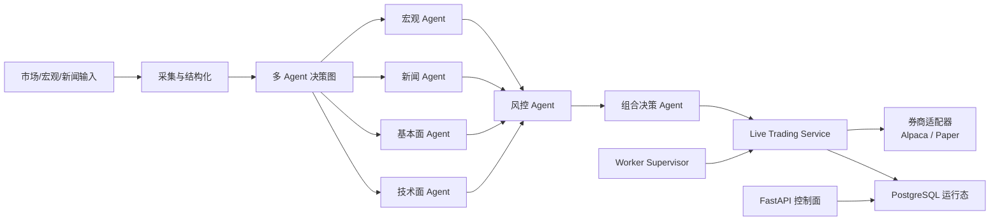

# FionaTrade 中文版 🚀

> 🤖 **全自主交易基础设施，不是玩具级 Notebook。**  
> FionaTrade 是一个端到端的多 Agent 交易平台，目标不是“做个会说话的策略脚本”，而是构建一套能够 **采集信息、理解市场、做出判断、执行交易、并且可运维可复盘** 的完整系统。

## FionaTrade 是什么

FionaTrade 的核心定位是：

> **一个 PostgreSQL 优先、可直连券商、带多 Agent 决策链的自主交易系统。**

它想解决的不是单点问题，而是把整条链路打通：

- 🧠 **会思考**
  - 通过多 Agent 拆分宏观、新闻、基本面、技术面、风控、组合决策
- 🧾 **会决策**
  - 不是把所有信息塞给一个黑箱模型，而是显式分层、显式聚合
- 🏦 **会下单**
  - 通过券商适配器直接接入 Paper / Live 交易
- 🕹️ **可运维**
  - 有 Web 控制面、Worker、Supervisor、数据库运行态、命令队列和回放工具
- 🔁 **可复盘**
  - 回测、Paper、Live 共用核心应用架构，而不是三套完全独立逻辑

## 为什么这个项目有意思

市面上很多“AI 交易项目”其实只有其中一块：

- 要么只是回测器
- 要么只是聊天机器人包一层金融 Prompt
- 要么只是图表 UI
- 要么根本没有真实执行能力

FionaTrade 的强项在于它不是单点 demo，而是试图把以下能力做成一个统一系统：

| 能力 | FionaTrade 的做法 |
|---|---|
| 决策 | 多 Agent 显式分工，而不是单一大 Prompt |
| 执行 | 直接接入券商适配器，支持 Paper / Live |
| 控制面 | FastAPI + Jinja UI + DB 运行态 |
| 运行时 | Web / Worker / DB / Broker 边界清晰 |
| 安全性 | 风控门、命令队列、回放和 Preflight 检查 |
| 研究闭环 | 回测、Paper、Live 放在同一系统里演进 |

一句话总结：

> **FionaTrade 想做的是“自主交易操作系统”，而不是“会输出 BUY/SELL 的脚本”。**

## 多 Agent 到底强在哪

FionaTrade 不是把“AI”当成一个大脑，而是拆成一组专门角色：

| Agent | 职责 |
|---|---|
| `MacroAnalystAgent` | 负责宏观环境、FRED 数据、风险偏好判断 |
| `NewsSentimentAgent` | 负责新闻/事件理解和方向叙事 |
| `FundamentalsAgent` | 负责基本面和分析师背景信息 |
| `TechnicalsAgent` | 负责规则化技术结构和价格状态 |
| `RiskManagerAgent` | 负责风险约束和仓位级审查 |
| `PortfolioManagerAgent` | 负责输出最终可执行交易决策 |

这种拆法的价值非常大：

- 更容易解释每一步为什么这么做
- 更容易回放某一单到底死在哪个环节
- 更容易逐层加规则和限制
- 更容易做测试和回归验证
- 更容易把系统慢慢做强，而不是越堆越黑箱

所以 FionaTrade 的“多 Agent”不是单纯为了好听，而是为了：

> **把交易决策从一个不可解释的大黑盒，变成一个可以逐层调试、逐层加强的系统工程。**

## 直连券商执行是重点

这个项目最值得强调的一点是：

> **它不是只会回测。**

FionaTrade 里真实存在：

- `app/broker/alpaca.py`
  - Alpaca 适配器，负责 Paper / Live 执行
- `app/broker/paper.py`
  - 本地 Paper 执行模型
- `app/services/live_trading.py`
  - 把决策真正送到执行层的 Live Orchestrator

也就是说，这套系统天然支持：

1. 回测
2. 模拟盘
3. 实盘接入

而不是做到一半才发现“执行层还没写”。

## 系统主链路



这条链路代表的不是“能跑起来”，而是：

- 能采信息
- 能做推理
- 能过风控
- 能下单
- 能追踪运行时状态
- 能做复盘

## 运行时架构也很强

```text
web    -> FastAPI + Jinja UI + API control plane
worker -> scheduler + ingestion + live cycle + command pump
db     -> PostgreSQL runtime state, caches, control records, results
broker -> Alpaca / Paper execution adapters
```

这个拆分很关键，因为它意味着：

- UI 不是伪运行时
- Worker 不是一边做后台一边假装是前端
- Runtime 状态不会随着进程退出直接蒸发
- 执行路径不是写到最后才临时拼上去

换句话说，这个项目看上去更像一个真正系统，而不是零散脚本集合。

## 核心亮点

- 🤖 多 Agent 显式决策链
- 🏦 直连 Alpaca 的 Paper / Live 执行
- 🗄️ PostgreSQL 驱动的运行态与命令队列
- 🧵 Worker + Supervisor 双层运行模型
- 📊 回测、模拟盘、实盘共用核心架构
- 🛡️ Live Guardrails 和风控约束
- 🧪 Replay / Preflight / Golden Eval 工具链
- 🖥️ 可视化控制面和监控页面

## 快速开始

### 1. 安装

```bash
pip install -e .[dev]
```

### 2. 配置

```bash
cp .env.example .env
```

需要填写：

- 数据库 URL
- LLM 配置
- 行情数据凭证
- 券商凭证

运行时前提：

- 生产环境默认使用 **PostgreSQL**
- SQLite 只保留给测试和本地临时夹具
- 所有持久化时间戳按 UTC 处理

### 3. 本地运行

```bash
./run_local.sh
```

或分开启动：

```bash
uvicorn app.main:app --host 0.0.0.0 --port 6888 --reload
python -m app.worker.supervisor
```

然后访问：

```text
http://localhost:6888
```

## 测试

```bash
pytest
```

关键验证区域：

- `tests/test_live_event_driven.py`
- `tests/test_live_guardrails.py`
- `tests/test_live_service_core.py`
- `tests/test_worker_control_plane.py`
- `tests/test_brokers.py`
- `tests/test_paper_engine.py`
- `tests/test_backtest_agent_mode.py`

## 文档入口

- 英文公开版首页：
  [../README.md](../README.md)
- 原操作型 README：
  [README.operator.zh-CN.md](README.operator.zh-CN.md)
- Agent 协作契约：
  [../AGENTS.md](../AGENTS.md)
- 参考文档：
  [reference](reference)

## 范围说明

这个公开仓库刻意不包含：

- 私有策略数据集
- 私有运行记忆和交接日志
- 已拆出去的 Benzinga 私有策略模块

## 免责声明

本项目用于研究和工程用途。  
它 **不是投资建议**、**不是盈利承诺**，也 **不能替代独立风险评估**。
